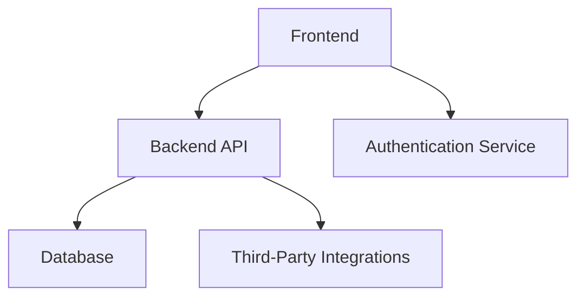

---

#  Project Name

**Brief Description:** A concise, one-line summary of what this project does or aims to achieve.

## Features

- **Core Feature 1**: Briefly describe the primary functionality.
- **Core Feature 2**: Highlight another essential feature.
- **Cross-Platform**: Specify if the application targets desktop, mobile, or web platforms.

## Architecture

This project follows a modular and scalable architecture.

### Tech Stack

- **Frontend**: (e.g., Flutter, Delphi VCL/FMX)
- **Backend**: (e.g., ASP.NET, Delphi RESTful Services)
- **Database**: Specify the database used (e.g., SQL Server, Firebase, Firebird).

## Installation

### Prerequisites

- Development tools installed:
  - For C#: Visual Studio
  - For Delphi: Delphi IDE (Community/Professional)
  - For Flutter: Flutter SDK
- Other dependencies (if any).

## Usage

1. Launch the application:
   - For desktop: Run the executable file from the build directory.
   - For mobile: Deploy to an emulator or physical device.
   - For web: Access via a browser if hosting is configured.
2. Access key functionalities as described in the Features section.

## Roadmap

- **Phase 1**: Implement MVP features.
- **Phase 2**: Add advanced features and polish UI/UX.
- **Phase 3**: Optimize for performance and scalability.

## Contributing

Contributions are welcome! Follow these steps to contribute:

1. Fork the repository.
2. Create a feature branch:
3. Commit changes and push to your fork.
4. Open a pull request.

## Acknowledgments

- **Icons**:  
  - [Font Awesome](https://fontawesome.com) - For icons used in the project.
  - [Feather Icons](https://feathericons.com) - For minimalist, customizable icons.
- **Libraries**:  
  - [Newtonsoft.Json](https://www.newtonsoft.com/json) - A popular JSON framework for .NET.
  - [Flutter SDK](https://flutter.dev) - For building cross-platform mobile and web applications.
- **Assets**:  
  - [Unsplash](https://unsplash.com) - For free high-resolution images used in the project.
  - [Pexels](https://www.pexels.com) - For free stock photos.
- **Fonts**:  
  - [Google Fonts](https://fonts.google.com) - For beautiful open-source fonts.

## License

This project is licensed under the MIT License. See the [`LICENSE`](LICENSE) file for details.

## Author

Developed by **[Isaac Caires](https://zrfisaac.github.io)**  
- 🌐 **[Portfolio](https://zrfisaac.github.io)**
- 📱 **WhatsApp:** [+55 (71) 9 8398-0801](https://wa.me/message/HIUVCFWYE3EXG1)  
- 📧 **E-mail:** [zrfisaac@gmail.com](mailto:zrfisaac@gmail.com)  
