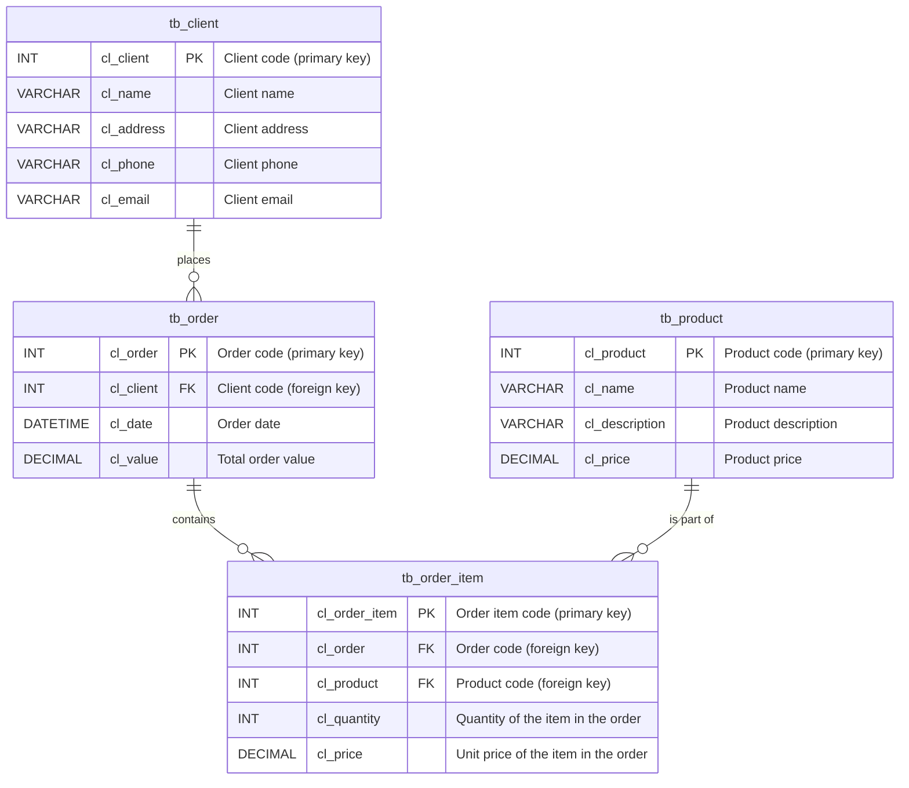

# Docsify Template

> A simple [Docsify](https://github.com/docsifyjs/docsify/) template for creating Markdown-based documentation sites, with no build process required.

## Site Setup

### Static Webserver
Upload these template files to any static web server. The file `.nojekyll` is only required if hosting the site on GitHub Pages and otherwise can be removed.

### GitHub Pages

#### Hosting Site

To host this template on GitHub Pages do the following:  

1. Log into GitHub if you have not done so already
2. Tap the **Use this template** button in the upper-right of this GitHub Repository and choose **Create a new repository**
3. Enter a name for your new Repository and then tap the **Create repository** button
4. Once your new Repostitory is created go to **Settings**, then select **Pages** from the left-hand sidebar, and under **Branch** choose **main** and then tap the **Save** button
5. Wait a minute or two and refresh the same **Pages** page - once your site is ready a message will be displayed at the top of the screen along with a site link and a **Visit site** button

#### Editing Content

How about editing the content of your new Docsify site on GitHub Pages? View the Markdown page you want to edit (for example, **README.md**) and tap the **Pencil Icon**, then save any changes by tapping the green **Commit changes...** button. In just a few moments the Docsify site will be automatically updated to reflect those changes.

### Viewing Locally 
Run `npx serve .` (Node.js users) or `python -m http.server 8000` (Python users) in the repo folder to serve run locally.

## Docsify Documentation

To learn more about using Docsify, visit https://docsify.js.org.

$$
V = I \cdot R
$$

