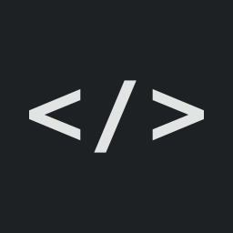
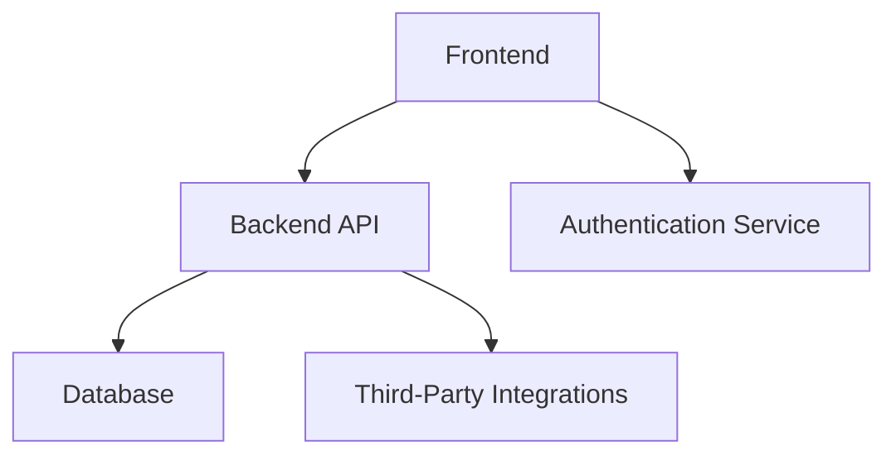

---

#  Nome do Projeto

**Descrição Breve:** Um resumo conciso de uma linha sobre o que este projeto faz ou visa alcançar.

## Funcionalidades

- **Funcionalidade Principal 1**: Descrição breve da funcionalidade principal.
- **Funcionalidade Principal 2**: Destaque para outra funcionalidade essencial.
- **Plataforma Cruzada**: Especifique se a aplicação é destinada a desktop, mobile ou web.

## Arquitetura

Este projeto segue uma arquitetura modular e escalável.

### Stack Tecnológica

- **Frontend**: (ex.: Flutter, Delphi VCL/FMX)
- **Backend**: (ex.: ASP.NET, Delphi RESTful Services)
- **Banco de Dados**: Especifique o banco de dados utilizado (ex.: SQL Server, Firebase, Firebird).

## Instalação

### Pré-requisitos

- Ferramentas de desenvolvimento instaladas:
  - Para C#: Visual Studio
  - Para Delphi: IDE Delphi (Community/Professional)
  - Para Flutter: SDK Flutter
- Outras dependências (se houver).

## Uso

1. Inicie a aplicação:
   - Para desktop: Execute o arquivo executável a partir do diretório de build.
   - Para mobile: Implemente no emulador ou dispositivo físico.
   - Para web: Acesse via navegador se o serviço de hospedagem estiver configurado.
2. Acesse as principais funcionalidades conforme descrito na seção de Funcionalidades.

## Roteiro

- **Fase 1**: Implementar as funcionalidades principais (MVP).
- **Fase 2**: Adicionar funcionalidades avançadas e melhorar o design da interface.
- **Fase 3**: Otimizar o desempenho e escalabilidade.

## Contribuindo

Contribuições são bem-vindas! Siga os seguintes passos para contribuir:

1. Faça um fork do repositório.
2. Crie uma branch para a nova funcionalidade.
3. Commit suas alterações e faça push para o seu fork.
4. Abra um pull request.

## Agradecimentos

- **Ícones**:  
  - [Font Awesome](https://fontawesome.com) - Para ícones usados no projeto.
  - [Feather Icons](https://feathericons.com) - Para ícones minimalistas e personalizáveis.
- **Bibliotecas**:  
  - [Newtonsoft.Json](https://www.newtonsoft.com/json) - Framework popular de JSON para .NET.
  - [Flutter SDK](https://flutter.dev) - Para construir aplicações móveis e web multiplataforma.
- **Assets**:  
  - [Unsplash](https://unsplash.com) - Para imagens de alta resolução gratuitas usadas no projeto.
  - [Pexels](https://www.pexels.com) - Para fotos gratuitas de banco de imagens.
- **Fontes**:  
  - [Google Fonts](https://fonts.google.com) - Para fontes de código aberto e de boa qualidade.

## Licença

Este projeto está licenciado sob a Licença MIT. Veja o arquivo [`LICENSE`](LICENSE) para mais detalhes.

## Autor

Desenvolvido por **[Isaac Caires](https://zrfisaac.github.io)**
- 🌐 **[Portfólio](https://zrfisaac.github.io)**
- 📱 **WhatsApp:** [+55 (71) 9 8398-0801](https://wa.me/message/HIUVCFWYE3EXG1)  
- 📧 **E-mail:** [zrfisaac@gmail.com](mailto:zrfisaac@gmail.com)  
